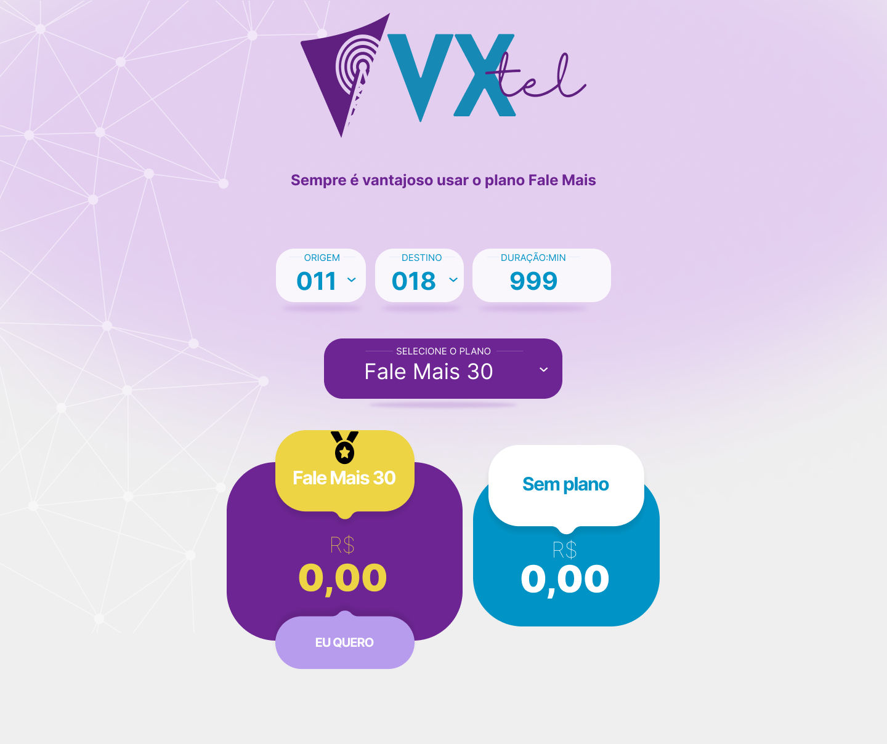

# VXTEL

***

Simulador de Planos de Telefonia

# Logo

  

> Foi criado uma marca para o projeto, trazendo elementos da empresa pai VORTX.

# Layout Base

  

>[FIGMA](https://www.figma.com/file/Y2wlPcbaSRjQcHASehHXIq/Vortx?node-id=0%3A1)

## BACK-END

> O Documento abaixo tem como objetivo descrever
> [Documento](backend/README.md)

## FRONT-END

> O Documento abaixo tem como objetivo descrever
> [Documento](frontend/README.md)

