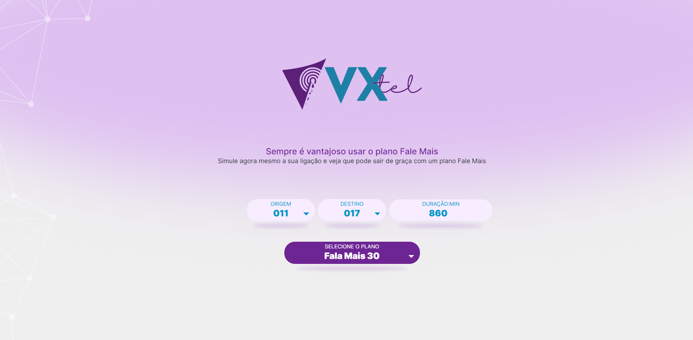
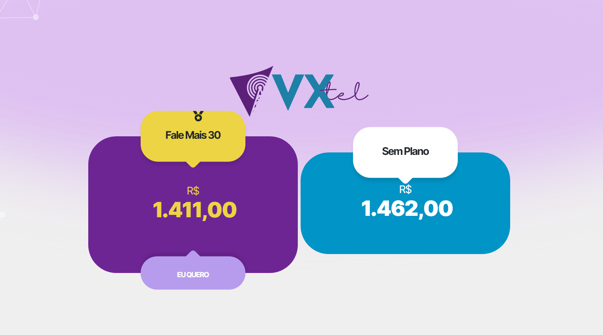

> [[Voltar]](../README.md)
***

  

  

  

Simulador de Planos de Telefonia

***
# VX TEL - frontend

Projeto Teste para VORTX

> O Documento abaixo terá uma breve descrição do projeto

_Tecnologias_

### #FrontEnd

- React
- TypeScript
- Axios
- Bootstrap
- Styled Components
- Magic.css
- Eslint
- Prettier

## Instalação das dependências

_Após fazer a copia do repositório executar o comando abaixo para fazer download de todos as dependncias_^

> NPM i

## Rodando o Projeto

_O projeto deverá ser rodado pelo comando abaixo_^

> NPM start
> O servidor será iniciado em : http://localhost:3000
